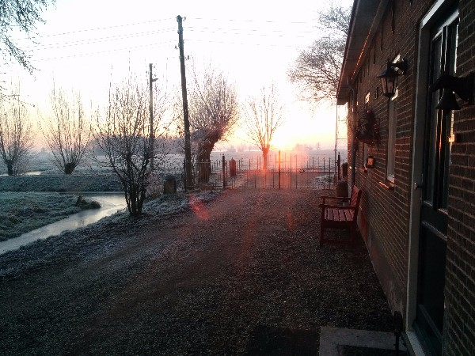

The Farm Cottage at Achterbroek 1 is a **holiday cottage** in the Dutch polderland in the **province of Zuid Holland**.

The holiday cottage is situated in the Krimpenerwaard polder landscape at the old farm at Acheterbroek 1 on the edge of the small village of Berkenwoude. The cottage is surrounded by its own garden and waterways and faces south with views across the polder. There are lawns around the cottage with plenty of room for children to play. Inside there is a modern open plan living/dining/kitchen with panoramic views and direct access to the garden. Upstairs there are two bedrooms in the eaves of the roof.

    <input checked="checked" id="ind-1" name="gallery" type="radio"><label for="ind-1"></label>
    <input id="ind-2" name="gallery" type="radio"><label for="ind-2"></label>
    <input id="ind-3" name="gallery" type="radio"><label for="ind-3"></label>
    <input id="ind-4" name="gallery" type="radio"><label for="ind-4"></label>
    <input id="ind-5" name="gallery" type="radio"><label for="ind-5"></label>
    <input id="ind-6" name="gallery" type="radio"><label for="ind-6"></label>
    <ul class="gallery-images">
        <li class="gallery-item">
            <label for="ind-1"></label>
        </li>
        <li class="gallery-item">
            <label for="ind-2"></label>
        </li>
        <li class="gallery-item">
            <label for="ind-3"></label>
        </li>
        <li class="gallery-item">
            <label for="ind-4"></label>
        </li>
        <li class="gallery-item">
            <label for="ind-5"></label>
        </li>
        <li class="gallery-item">
            <label for="ind-6"></label>
        </li>
    </ul>

# Location

The cottage is located in the heart of the [Krimpenerwaard district](https://en.wikipedia.org/wiki/Krimpenerwaard) to the east of Rotteram and to the south of Gouda.

<iframe src="https://www.google.com/maps/embed?pb=!1m14!1m8!1m3!1d177552.2162102959!2d4.70714601424541!3d51.957325725712614!3m2!1i1024!2i768!4f13.1!3m3!1m2!1s0x47c5d362faacac19%3A0xa503adc5388b634c!2sAchterbroek+1%2C+2825+NC+Berkenwoude%2C+Netherlands!5e0!3m2!1sen!2snl!4v1493452651216" width="600" height="450" frameborder="0" allowfullscreen></iframe>

[More information on the best directions to get to us](directions).

# Amenities

## Property Type

* Farm cottage
* Self-catering
* Max. occupancy = 4
* Non-smoking only
* Pets not allowed
* Children welcome

## General

* Wireless Internet
* Parking
* Linens Provided
* Towels Provided

## Kitchen

* Coffee Maker
* Dishes & Utensils
* Freezer
* Microwave
* Oven
* Refrigerator
* Hob
* Toaster
* Child's Highchair
* Iron & Board

## Living Room

* DVD Player
* Games
* Books (Dutch/German/English)
* Television
* Garden

## Bathrooms

* 1 Bathroom, walk in shower (no bath)
* 1 Separate WC upstairs

## Bedrooms

* 2 Bedrooms, Sleeps 4
* Bedroom 1 - 1 Double Bed, 1 Cot
* Bedroom 2 - 2 Single Beds that can be joined together into a double

## Leisure Activities

* Bird watching
* Scenic drives
* Sight seeing
* Walking
* Cycling
* Canoeing

# Contact

Want more information or to enquire about making a booking? Contact us:

* Telephone
* E-mail
* [Facebook](https://www.facebook.com/achterbroek1/)
* [Airbnb](https://www.airbnb.com/rooms/17235951)
